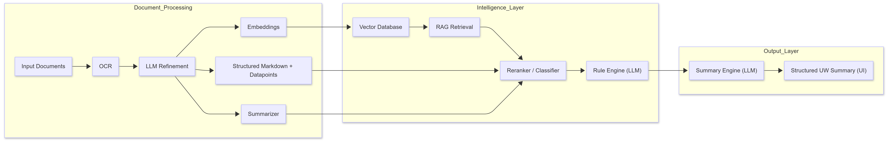

# AI Underwriting Assistant (Production Architecture)

## 🚀 Overview

This project represents a production-scale AI system designed to assist insurance underwriting by generating structured case summaries from multiple documents.

The system combines medical, financial, and application data into a single unified view, reducing manual review effort and improving decision consistency.

---

## ⚠️ Problem

Underwriters face challenges such as:

- Switching between multiple documents (medical, financial, application forms)  
- Text-heavy, non-actionable summaries  
- Manual data extraction (e.g., checking income, identifying medical risks)  

👉 Goal: Enable faster, more accurate underwriting through structured AI-driven summaries.

---

## 🧠 System Architecture

The system operates as a two-stage pipeline:

### Stage 1 — Document Processing  
Transforms raw documents into structured, searchable formats.

### Stage 2 — Rule Evaluation & Summary Generation  
Evaluates rules using relevant document content and generates final summaries.

---

## 🔄 End-to-End Flow

Document → OCR → Refinement → Summarization → Embeddings → Classification → Retrieval (RAG) → Rule Engine → Final Summary

---

## ⚙️ Core Components

### 1. OCR
- Extracts raw text from uploaded documents  
- Output: Unstructured text  

---

### 2. Document Refinement (LLM)
- Converts raw text into structured format  
- Extracts key datapoints  
- Outputs:
  - Structured markdown text  
  - Datapoints  
  - Input to summarizer  

---

### 3. Summarization
- Generates extractive summary  
- Provides contextual understanding  
- Stored alongside document  

---

### 4. Embedding Generation
- Converts document chunks into vectors  
- Enables semantic retrieval  

---

### 5. Classification (Reranker)
- Classifies document types  
- Handles merged documents  
- Routes documents to appropriate rule sets  

---

### 6. Retrieval (RAG)
- Fetches only relevant document chunks  
- Reduces token usage  
- Improves precision  

---

### 7. Rule Engine (LLM)
- Evaluates predefined rules  
- Uses:
  - Retrieved document chunks  
  - Summary context  

- Output:
  - PASS / FAIL  
  - Extracted values  

---

### 8. Summary Engine (LLM)
- Generates final structured underwriting summary  
- Combines outputs across documents  

---

## 📊 Scale (Representative)

- Hundreds of applications processed daily
- Multi-document inputs per case  
- Multiple LLM calls per document  

---

## 🧩 Architecture Diagram

  

---

## 📄 Sample Output

---

## ⚖️ Key Design Decisions

### Full Document vs RAG
- Initial system uses full context for accuracy  
- RAG introduced for cost optimization  

---

### Hybrid System (Rules + LLM)
- Rules → deterministic checks  
- LLM → interpretation  

👉 Reduces hallucination risk  

---

## ⚠️ Challenges

- OCR inconsistencies  
- Handling multi-document context  
- Balancing cost vs latency  
- Ensuring reliable outputs  

---

## 📈 Learnings

- LLMs require strong guardrails in production  
- Hybrid systems outperform pure LLM pipelines  
- Retrieval improves efficiency but requires tuning  

---

## 👩‍💼 My Role
 
- Defined AI pipeline and tradeoffs  
- Coordinated between business and engineering teams  
- Led development from concept to production  

---

## 🔒 Note

This is a generalized architecture representation based on a production AI system. Specific implementation details have been abstracted.
